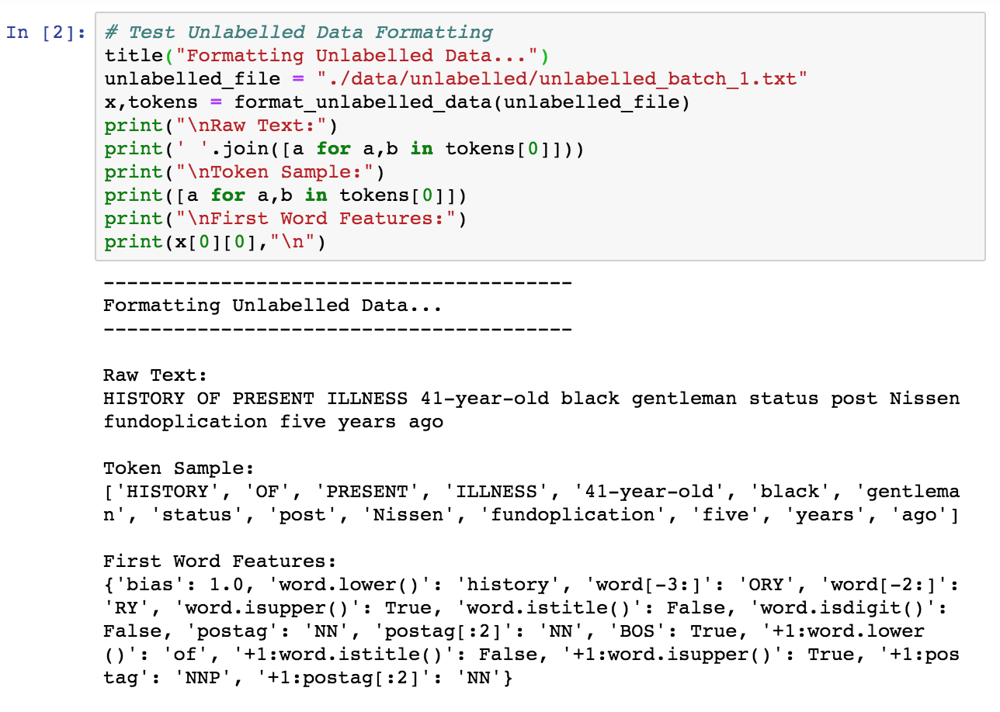
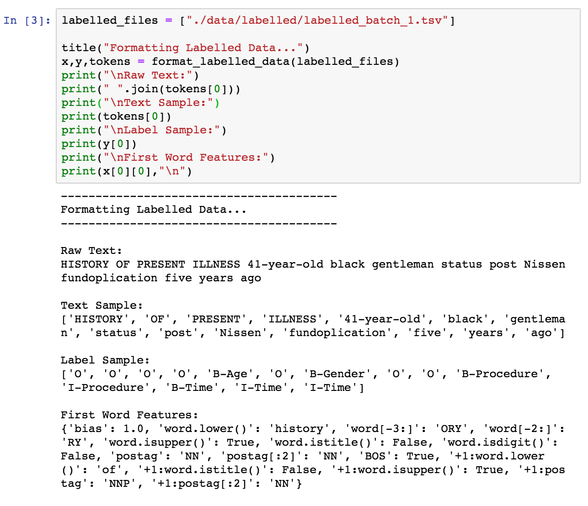
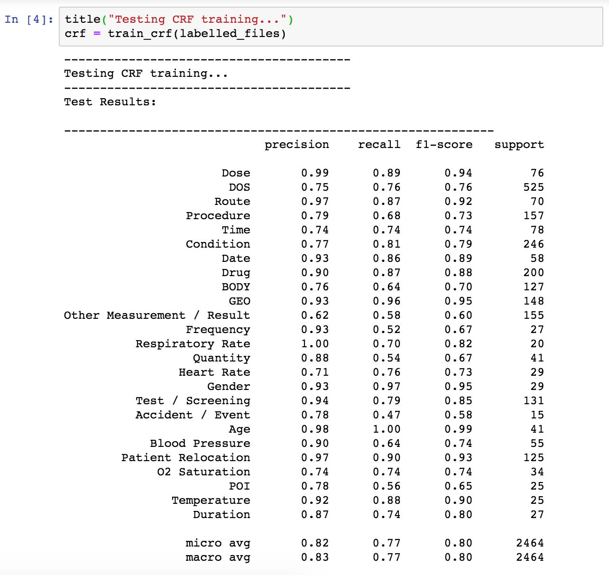
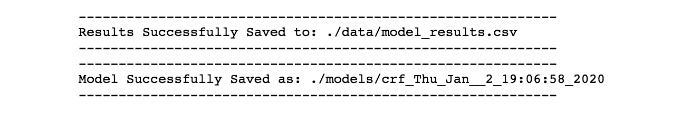
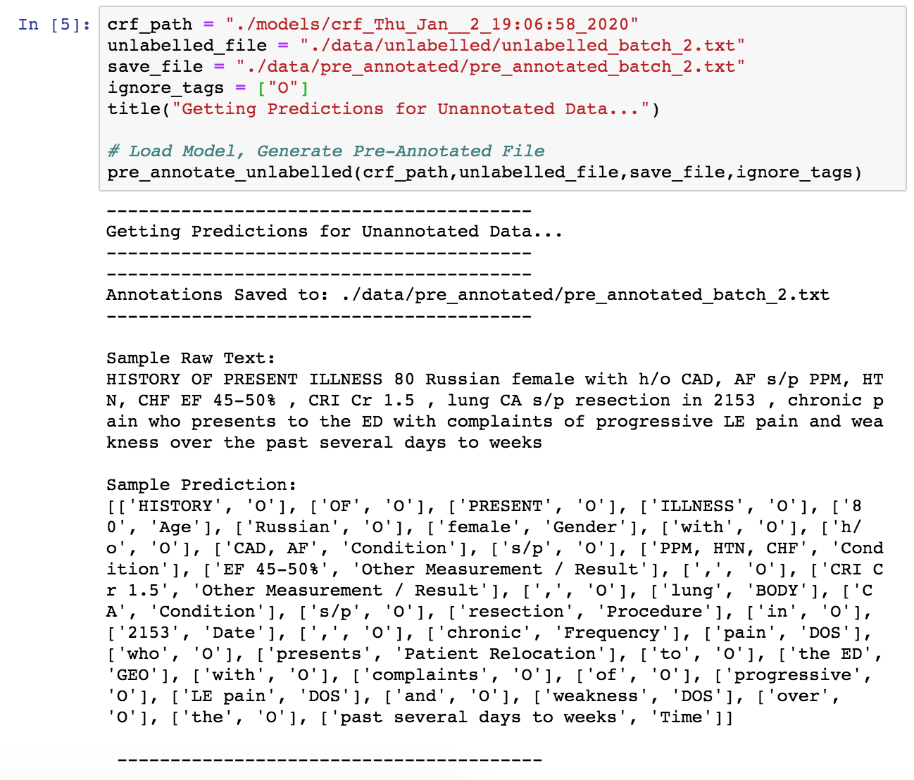

# Getting Started:
This repo is intended to work with the Dataturks NER annotation service.

## Requirements:

Environment can be set up using the following CL code:

- <code> pip install -r requirements.txt </code>

## Setting up a Dataturks NER Project

You can create a dataturks project by doing the following:

1. Go to https://dataturks.com/
2. Create an account by clicking “sign up” in the top right of the page
3. Sign in and navigate to https://dataturks.com/projects
4. Click “Create Dataset” on the left side of the https://dataturks.com/projects page
5. Select NER Tagging
Fill in your project specific info and submit

## Uploading Unlabelled Data
Now that you have created a project you can upload unlabelled data by doing the following:

1. Navigate to https://dataturks.com/projects
2. Click the “Home” on the left side of the page.
3. Select your NER Project you created
4. Click “Options” located at the top right corner of the page, select “Add Data”
5. Select Upload Raw Data
6. Choose your formatted .txt file and click submit.

## Downloading Labelled Data from Dataturks

Once you’ve labelled enough data you can download it by:

1. Navigating to you Dataturks Project
2. Clicking “Options” in the top right corner of the page and selecting download
3. Select “Completed Items” and “Standard NER Format” then click “Download”.

## Working with this Repo

The code for working with the Dataturks service is split up into three main files:

## 1. *formatting.py*

This file is called by the others to format unlabelled and labelled data before passing it to a CRF model.

You can use format_unlabelled_data() for .txt files formatted for upload to Dataturks:

And you can use format_labelled_data() for data that has been annotated and downloaded as .tsv from dataturks:

## 2. *training.py*

You can use training.py to train and evaluate CRF models with labelled data from Dataturks. Simply call the <code>train_crf()</code> function and pass it the file name to get a baseline CRF model as well as information on performance. 

## 3. *pre_annotate.py*

This will load a saved CRF model (from <code>train_crf()</code>) and use it to make predictions for unlabelled data. Simply pass in the saved CRF model, the unlabelled file and the name of the new save file to the function <code>pre_annotate_unlabelled()</code> and the script will pre-annotate your data and format it so it can be immediately uploaded to Dataturks.

For a notebook version of this walkthrough see "Sample Workflow.ipynb"